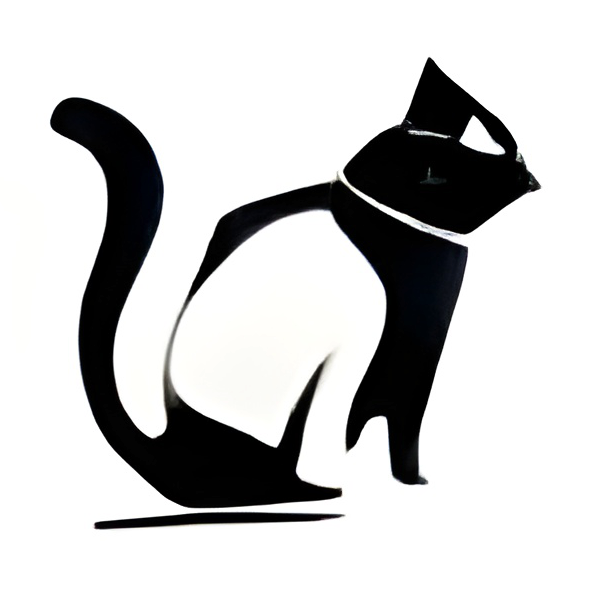

   <!-- Thank you coloors.co! -->

   <!-- 
   
      
    -->

   
   
      
   

    

   <!--  -->

   

# Introduction

Hello there! This is a site for cat images and videos.
If you want to check out a random picture/video present in the library, you can do so by going to [/random](https://apiofcats.xyz/random). Once there, you can constantly refresh the page (ctrl+R or cmd+R) to get new cat pics/vids :). There are currently 3.5k+ images and videos present in the evergrowing library. I got all of them through public sources (mostly reddit) and I DO NOT claim ownership of any of them

